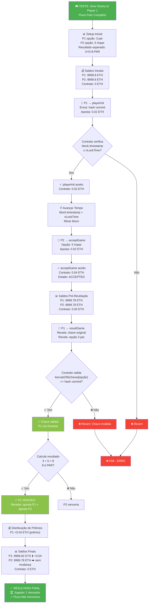
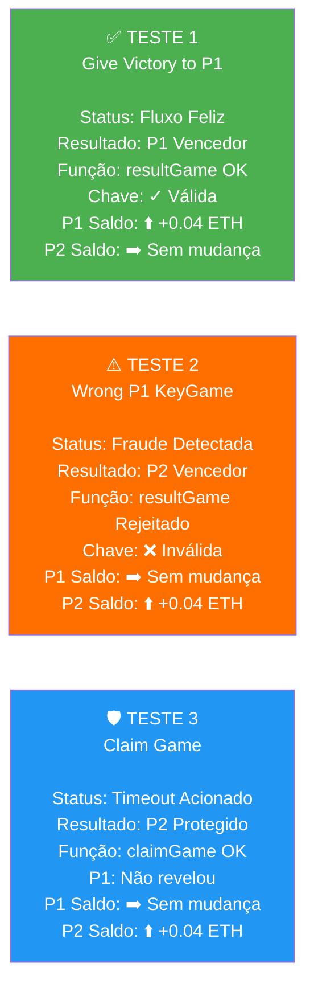
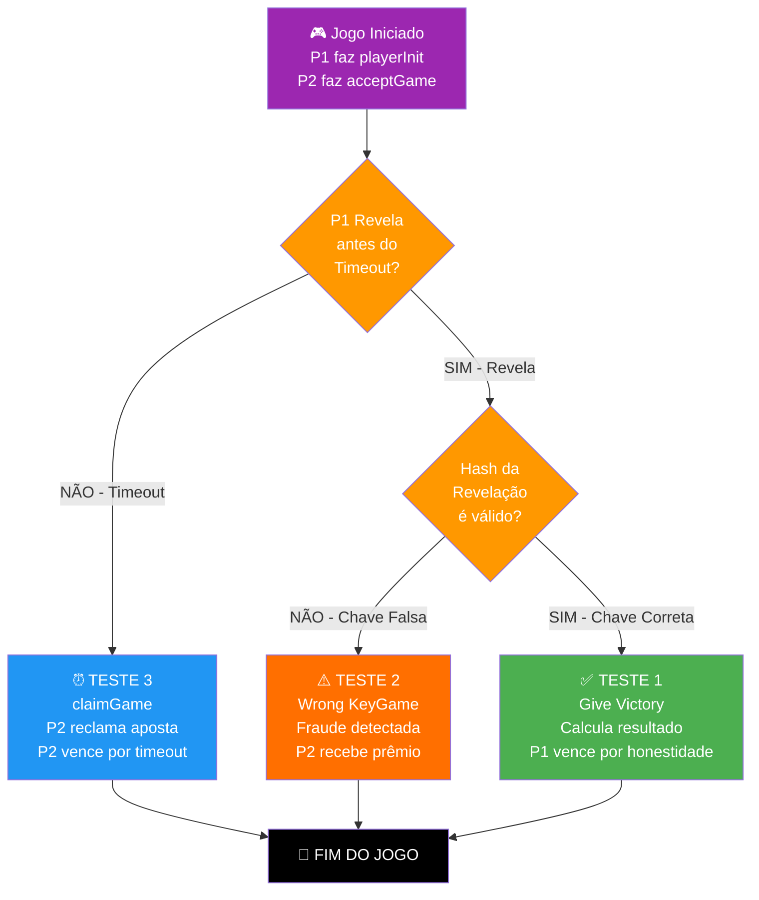

# Diagramas dos 3 Testes Principais

## Teste 1: Should Give Victory to Player 1 (Fluxo Feliz)

---

## Teste 2: Wrong P1 KeyGame (Detecção de Fraude)

```mermaid
graph TD
    A["🚨 TESTE: Wrong P1 KeyGame<br/>Tentativa de Trapaça"] --> B["📊 Setup Inicial<br/>P1 opção: 2<br/>P2 opção: 5<br/>P1 vai tentar TRAPACEAR"]
    
    B --> C["💰 Saldos Iniciais<br/>P1: 9999.8 ETH<br/>P2: 9999.8 ETH<br/>Contrato: 0 ETH"]
    
    C --> D["🔐 P1 → playerInit<br/>Envia: hash commit<br/>Chave original: abc123xyz<br/>Aposta: 0.02 ETH"]
    
    D --> E["✓ playerInit aceito<br/>Contrato: 0.02 ETH<br/>Hash armazenado no contrato"]
    
    E --> F["⏰ Avançar Tempo<br/>Satisfazer require de acceptGame"]
    
    F --> G["🎯 P2 → acceptGame<br/>Opção: 5<br/>Aposta: 0.02 ETH"]
    
    G --> H["✓ acceptGame aceito<br/>Contrato: 0.04 ETH<br/>Estado: ACCEPTED"]
    
    H --> I["📊 Saldos Pré-Revelação<br/>P1: 9999.78 ETH<br/>P2: 9999.78 ETH<br/>Contrato: 0.04 ETH"]
    
    I --> J["⚠️ P1 TENTA TRAPACEAR<br/>→ resultGame<br/>Revela: chave FALSA (abc123ab)<br/>Revela: opção 2"]
    
    J --> K{"Contrato valida<br/>keccak256(FALSA_CHAVE||2)<br/>== hash commit?"}
    K -->|❌ NÃO| L["❌ FRAUDE DETECTADA!<br/>Hash não corresponde!"]
    K -->|Sim| M["Seria aceito"]
    
    L --> N["⚖️ PUNIÇÃO APLICADA<br/>P1 perde a aposta<br/>P2 recebe o prêmio"]
    
    N --> O["💰 Redistribuição de Fundos<br/>Contrato envia:<br/>P2 ← aposta P1 + aposta P2"]
    
    O --> P["📊 Saldos Finais<br/>P1: 9999.78 ETH ➡️ sem mudança<br/>P2: 9999.82 ETH ⬆️ +0.04<br/>Contrato: 0 ETH"]
    
    P --> Q["✅ RESULTADO FINAL<br/>🏆 Jogador 2 Vencedor por Fraude<br/>✓ Sistema de segurança funcionou!"]
    
    style A fill:#FF6F00,color:#fff
    style Q fill:#FF6F00,color:#fff
    style L fill:#F44336,color:#fff
    style N fill:#FF9800,color:#fff
    style J fill:#FFEB3B,color:#000
```

---

## Teste 3: Should Claim Game (Timeout e Recuperação)

```mermaid
graph TD
    A["⏰ TESTE: Claim Game<br/>Timeout e Mecanismo de Proteção"] --> B["📊 Setup Inicial<br/>P1 inicializa mas NÃO revela<br/>P2 aguarda revelação<br/>Timeout acionado"]
    
    B --> C["💰 Saldos Iniciais<br/>P1: 9999.8 ETH<br/>P2: 9999.8 ETH<br/>Contrato: 0 ETH"]
    
    C --> D["🔐 P1 → playerInit<br/>Envia: hash commit<br/>Aposta: 0.02 ETH"]
    
    D --> E["✓ playerInit aceito<br/>Contrato: 0.02 ETH<br/>nLockTime definido"]
    
    E --> F["⏰ Avançar Tempo<br/>block.timestamp > nLockTime<br/>Satisfazer require de acceptGame"]
    
    F --> G["🎯 P2 → acceptGame<br/>Opção: 5<br/>Aposta: 0.02 ETH"]
    
    G --> H["✓ acceptGame aceito<br/>Contrato: 0.04 ETH<br/>Estado: ACCEPTED<br/>timeOutP2 definido"]
    
    H --> I["📊 Saldos Pré-Timeout<br/>P1: 9999.78 ETH<br/>P2: 9999.78 ETH<br/>Contrato: 0.04 ETH"]
    
    I --> J["🚫 P1 NÃO REVELA<br/>Deixa passar o deadline<br/>block.timestamp passa de timeOutP2"]
    
    J --> K["⏰ Avançar Tempo<br/>Simular passagem do timeout<br/>block.timestamp > timeOutP2"]
    
    K --> L{"Timeout<br/>Expirou?"}
    L -->|✓ Sim| M["✓ TIMEOUT ACIONADO<br/>P1 perdeu sua chance de revelar"]
    L -->|Não| N["Ainda há tempo"]
    
    M --> O["🛡️ P2 → claimGame<br/>Executa função de resgate<br/>Recupera aposta + compensação"]
    
    O --> P{"Contrato verifica<br/>1. Game ACCEPTED?<br/>2. Timeout passou?<br/>3. P2 é o caller?"}
    P -->|✓ Tudo OK| Q["✓ Claim válido"]
    P -->|Falhou| R["❌ Claim rejeitado"]
    
    Q --> S["💰 Distribuição<br/>Contrato devolve a P2:<br/>aposta P2 + aposta P1"]
    
    S --> T["📊 Saldos Finais<br/>P1: 9999.78 ETH ➡️ sem mudança<br/>P2: 9999.82 ETH ⬆️ +0.04<br/>Contrato: 0 ETH"]
    
    T --> U["✅ RESULTADO FINAL<br/>🛡️ Jogador 2 Protegido<br/>✓ Mecanismo de timeout funcionou<br/>✓ P1 foi punido por inação"]
    
    N --> V["❌ FIM - Ainda há tempo"]
    R --> V
    
    style A fill:#2196F3,color:#fff
    style U fill:#2196F3,color:#fff
    style M fill:#00BCD4,color:#fff
    style O fill:#00BCD4,color:#fff
    style K fill:#4DD0E1,color:#000
    style V fill:#F44336,color:#fff
```

---

## Resumo Comparativo dos 3 Testes

---

## Fluxo de Decisões - Qual Caminho Cada Teste Segue

---

## Legenda de Cores

| Cor | Significado |
|-----|------------|
| 🟢 Verde (#4CAF50) | ✅ Sucesso / Fluxo Feliz / Teste 1 |
| 🟠 Laranja (#FF6F00) | ⚠️ Fraude / Detecção / Teste 2 |
| 🔵 Azul (#2196F3) | 🛡️ Proteção / Timeout / Teste 3 |
| 🟡 Amarelo (#FF9800) | ⏰ Decisão / Bifurcação |
| 🔴 Vermelho (#F44336) | ❌ Erro / Rejeição |

